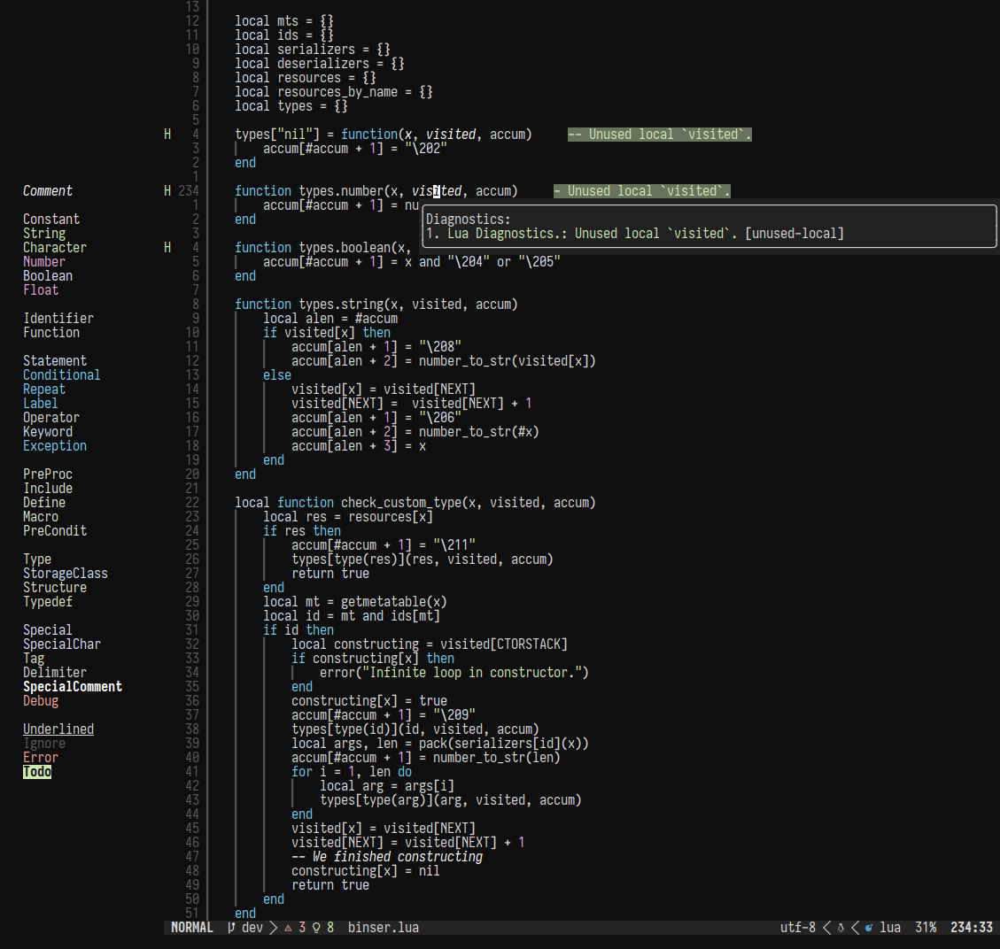

# sema.nvim

Port of the VSCode theme [sema](https://lunacookies.github.io/sema/) by lunacookies for neovim
with some support for LSP and treesitter semantic highlights.



Made using [lush.nvim](https://github.com/rktjmp/lush.nvim) for personal use because sema is my favorite vsc theme and I wanted to use it in nvim. Support for other nvim plugins will come
when I need it. I might port over the `chroma`, `soft`, and `light` variants at some point,
but no guarantees. Support for rust-analyzer semantics is better than lua_ls right now, this port is very work-in-progress.

[Lualine](https://github.com/nvim-lualine/lualine.nvim) theming is partially adapted from [lackluster.nvim](https://github.com/slugbyte/lackluster.nvim).

## Installation & usage

**Using [lazy.nvim](https://github.com/folke/lazy.nvim):**

```lua
return {
    {
        'onlytomorrow/sema.nvim',
        dependencies = { 'rktjmp/lush.nvim', }
    },
}
```

**Theming lualine**:

```lua
require('lualine').setup({
    options = { theme = 'auto' } -- or 'sema'
})
```
